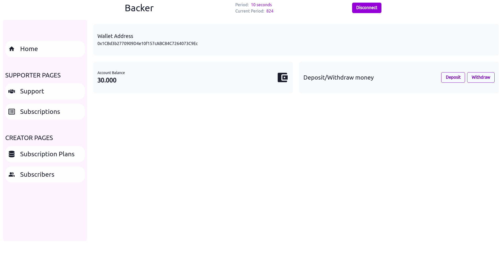

# Backer

A decentralized creator support platform on Polygon.

**For testing purposes, the period is set to 1 minute on Mumbai**

**currentPeriod = (block.timestamp - contractStartTime) / period**

## Demo video

- https://youtu.be/UiF1Q-PDyws

## Working App on Polygon Mumbai

- https://backer.vercel.app/

# How it works

A Supporter:

- Deposit Matic into the Backer smart contract
- Can withdraw her/his funds anytime
- Subscribe to the creators' subscription plans and support the creators with regular payments
- Can cancel the subscription and get the remaining funds back
- Can send tips to creators
- Can view the list of creators she/he subscribes to

A Creator:

- Can add subscription plans and wait for supporters to subscribe to them
- Can claim and withdraw the available amount of Matic anytime
- Can view her/his subscribers list

# UNS Integration

### Login with Unstoppable Domain

- Demo [video](https://www.youtube.com/watch?v=UiF1Q-PDyws&t=0s) - "Login chapter" 0:00-0:30

### Integrating UNS Domain Resolution

- A Supporter can search for a creator using either UNS domain or Ethereum address. then she/he can subscribe to the creator's subscription plans or send tip to the creator.

  - Demo [video](https://www.youtube.com/watch?v=UiF1Q-PDyws&t=135s) - "Subscribe to a plan chapter" 2:15-3:11
  - Demo [video](https://www.youtube.com/watch?v=UiF1Q-PDyws&t=362s) - "Send tip chapter" 6:02-6:45

- If a supporter had a UNS domain, the creator could fetch the domain-associated records. e.g. the creator could fetch the email address record and use it to send exclusive content to the supporter.
  - Demo [video](https://www.youtube.com/watch?v=UiF1Q-PDyws&t=192s) - "Visit subscribers chapter" 3:12-3:50

# Person of Contact

- Discord ID: soheil#1703
- UnstoppableDomain registered account email address: [soheilrasekh555@gmail.com](mailto:soheilrasekh555@gmail.com)

# License

available under the MIT license. See the `LICENSE` file for more info.
