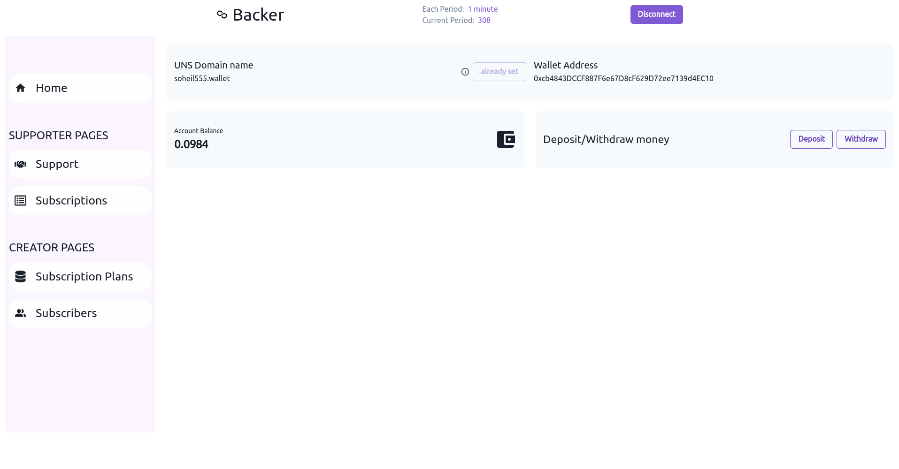

# Backer

A decentralized creator support platform on Polygon.

# How it works

A Supporter:

- Deposit Matic into the Backer smart contract
- Can withdraw her/his funds anytime
- Subscribe to the creators' subscription plans and support the creators with regular payments
- Can cancel the subscription and get the remaining funds back
- Can send tips to creators

A Creator:

- Can add subscription plans and wait for supporters to subscribe to them
- Can claim and withdraw the available amount of Matic anytime

